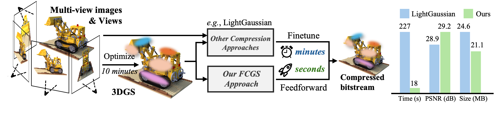
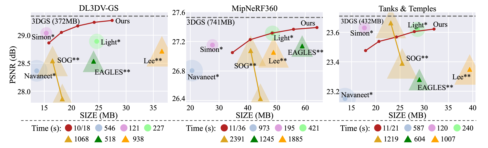

# [ARXIV'24] FCGS
Official Pytorch implementation of **Fast Feedforward 3D Gaussian Splatting Compression**.
## A fast, hassle-free and optimization-free solution for 3D Gaussian Splatting Compression!

[Yihang Chen](https://yihangchen-ee.github.io), 
[Qianyi Wu](https://qianyiwu.github.io), 
[Mengyao Li](https://scholar.google.com/citations?user=fAIEYrEAAAAJ&hl=zh-CN&oi=ao), 
[Weiyao Lin](https://weiyaolin.github.io),
[Mehrtash Harandi](https://sites.google.com/site/mehrtashharandi/),
[Jianfei Cai](http://jianfei-cai.github.io)

[[`Arxiv`](https://yihangchen-ee.github.io/Fast_Feedforward_3D_Gaussian_Splatting_Compression____ARXIV.pdf)] [[`Project`](https://yihangchen-ee.github.io/project_fcgs/)] [[`Github`](https://github.com/YihangChen-ee/FCGS)]

## Links
Welcome to check a series of works from our group on 3D radiance field representation compression as listed below:
- 🎉 [CNC](https://github.com/yihangchen-ee/cnc/) [CVPR'24] is now released for efficient NeRF compression! [[`Paper`](https://openaccess.thecvf.com/content/CVPR2024/papers/Chen_How_Far_Can_We_Compress_Instant-NGP-Based_NeRF_CVPR_2024_paper.pdf)] [[`Arxiv`](https://arxiv.org/pdf/2406.04101)] [[`Project`](https://yihangchen-ee.github.io/project_cnc/)]
- 🏠 [HAC](https://github.com/yihangchen-ee/hac/) [ECCV'24] is now released for efficient 3DGS compression! [[`Paper`](https://www.ecva.net/papers/eccv_2024/papers_ECCV/papers/01178.pdf)] [`Arxiv`](https://arxiv.org/pdf/2403.14530)] [[`Project`](https://yihangchen-ee.github.io/project_hac/)]
- 🚀 [FCGS](https://github.com/yihangchen-ee/fcgs/) [ARXIV'24] is now released for fast optimization-free 3DGS compression! [[`Arxiv`](https://arxiv.org/pdf/2410.08017)] [[`Project`](https://yihangchen-ee.github.io/project_fcgs/)]

## Overview
<p align="left">

</p>

Although various compression techniques have been proposed, previous art suffers from a common limitation: 
*for any existing 3DGS, per-scene optimization is needed to achieve compression, making the compression sluggish and slow.* 
To address this issue, we introduce Fast Compression of 3D Gaussian Splatting (FCGS), 
an optimization-free model that can compress 3DGS representations rapidly in a single feed-forward pass,
which significantly reduces compression time from minutes to seconds.

## Performance
<p align="left">

</p>

While all the other approaches are optimization-based compression which have natural advantages for a better RD performance, we still outperform most of them in an optimization-free manner for fast compression.
Our compression time is only ```1/10``` compared to others!

## Installation

We tested our code on a server with Ubuntu 20.04.1, cuda 11.8, gcc 9.4.0. We use NVIDIA L40s GPU (48G).

1. Clone our code
```
git clone git@github.com:YihangChen-ee/FCGS.git --recursive
```

2. Install environment
```
conda env create --file environment.yml
conda activate FCGS_env
```

3. Install ```tmc3``` (for GPCC)

- Please refer to [tmc3 github](https://github.com/MPEGGroup/mpeg-pcc-tmc13) for installation.
- Don't forget to add ```tmc3``` to your environment variable, otherwise you must manually specify its location [in our code](https://github.com/YihangChen-ee/FCGS/blob/main/model/gpcc_utils.py) by searching ```change tmc3 path``` (2 places in total).
- Tips: ```tmc3``` is commonly located at ```/PATH/TO/mpeg-pcc-tmc13/build/tmc3```.

## Run
FCGS can *directly* compress any existing 3DGS representations to bitstreams. The input should be a *.ply* file following the 3DGS format.

### To compress a *.ply* file to bitstreams, run:

```
python encode_single_scene.py --lmd A_lambda --ply_path_from PATH/TO/LOAD/point_cloud.ply --bit_path_to PATH/TO/SAVE/BITSTREAMS --determ 1
```
 - ```lmd```: the trade-off parameter for size and fidelity. Chosen in [```1e-4```, ```2e-4```, ```4e-4```, ```8e-4```, ```16e-4```].
 - ```ply_path_from```: A *.ply* file. Path to load the source *.ply* file.
 - ```bit_path_to```: A directory. Path to save the compressed bitstreams.
 - ```determ```: see [atomic statement](https://github.com/YihangChen-ee/FCGS/blob/main/docs/atomic_statement.md)

### To decompress a *.ply* file from bitstreams, run:

```
python decode_single_scene.py --lmd A_lambda --bit_path_from PATH/TO/LOAD/BITSTREAMS --ply_path_to PATH/TO/SAVE/point_cloud.ply
```
 - ```lmd```: the trade-off parameter for size and fidelity. Chosen in [```1e-4```, ```2e-4```, ```4e-4```, ```8e-4```, ```16e-4```].
 - ```bit_path_from```: A directory. Path to load the compressed bitstreams.
 - ```ply_path_to```: A *.ply* file. Path to save the decompressed *.ply* file.

### To decompress a *.ply* file from bitstreams and validate fidelity of the decompressed 3DGS, run:

```
python decode_single_scene_validate.py --lmd A_lambda --bit_path_from PATH/TO/LOAD/BITSTREAMS --ply_path_to PATH/TO/SAVE/point_cloud.ply --source_path PATH/TO/SOURCE/SCENES
```
 - ```source_path```: A directory. Path to load the source scene images for validation.

### Tips
FCGS is compatible with pruning-based techniques such as [Mini-Splatting](https://github.com/fatPeter/mini-splatting) and [Trimming the fat](https://github.com/salmanali96/trimming-the-fat). You can *directly* apply FCGS to the *.ply* file output by these two approaches to further boost the compression performance.

## CUDA accelerated arithmetic codec
We alongside publish a CUDA-based arithmetic codec implementation, you can find it in [arithmetic](https://github.com/YihangChen-ee/FCGS/blob/main/submodules/arithmetic) and its usage [here](https://github.com/YihangChen-ee/FCGS/blob/main/model/encodings_cuda.py).

## Contact

- Yihang Chen: yhchen.ee@sjtu.edu.cn

## Citation

If you find our work helpful, please consider citing:

```bibtex
@article{fcgs2024,
  title={Fast Feedforward 3D Gaussian Splatting Compression},
  author={Chen, Yihang and Wu, Qianyi and Li, Mengyao and Lin, Weiyao and Harandi, Mehrtash and Cai, Jianfei},
  journal={arXiv preprint},
  year={2024}
}
```


## Acknowledgement

 - We thank all authors from [3D-GS](https://github.com/graphdeco-inria/gaussian-splatting) for presenting such an excellent work.
 - We thank [Xiangrui](https://liuxiangrui.github.io)'s help on GPCC codec.
